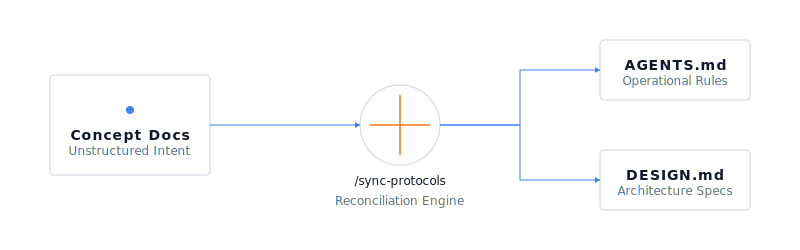

# 

When I start a new project now, I do not open with a prompt. I open with a blank concept folder.

This is a pragmatic experiment in building greenfield projects from a concept rather than from a chain of prompts. The code comes later: first you get the intent right, in plain markdown, where the agent can read it.

## The Problem

A chain of prompts feels productive. You ask an agent to "build a web app", it generates boilerplate, and you are moving within seconds.

Then the problems begins. Halfway through you realize the database was the wrong call. You switch libraries. You rewrite core logic. You spend more time correcting the agent's assumptions than building the product, all because the requirements were never broken down before the code started. Each prompt is a local decision with no shared plan behind it, so the project drifts.

## The Shift

This protocol flips the workflow. It is built on a simple thesis: if you do the rigorous thinking upfront in a concept document, you can largely hand off the execution to an AI agent.

You start with a blank concept folder. You write the problem statement and the constraints. You use the AI purely as a sounding board. You run theoretical pen tests and look for holes in your logic before a single line of code is written.

Because the protocol handles the mechanics of how work gets executed (slicing tasks, self-healing, and restarting exhausted sessions), the actual coding phase becomes mechanical. As a minor side effect, this also makes the project entirely harness agnostic—whether you boot up Cursor, Claude Code, or Antigravity, the agent reads the rules from the repo and gets to work.

## A concept layer, not a loop

"Loop" has become the shorthand for the agentic execution cycle: the model acts, observes the result, and goes again until the work is done (Anthropic's agentic loop; tools like Claude Code even expose a `/loop`). ai-protocol is not that, and it is not an interval runner either. It is the layer the loop runs against.

It shares the loop's instincts (durable, verifiable iteration with recovery), but it puts the thinking before the cycle rather than inside it. The concept docs fix intent up front, `AGENTS.md` fixes the contract, and `BUILD_STATE.md` holds the state. With those in the repo, any loop, in any harness, becomes mechanical and resumable: it reads the contract and the state, runs the next verified slice, and checkpoints. The loop is the engine; ai-protocol is the track it runs on.

## The Lifecycle

If you want to try this out, kickstart a project:

```bash
bash <(curl -s https://raw.githubusercontent.com/dnlbox/ai-protocol/main/kickstart.sh) my-project
```

Or via degit:

```bash
npx degit dnlbox/ai-protocol/template my-project
```

Here is how the workflow operates.

### Stage 1: The Concept Phase

You start in `docs/concept/`. Spend real time here. There is no source code. You write out the problem statement, user journeys, and constraints in plain markdown. The AI acts as a sounding board to interrogate your design, not a typist to generate boilerplate.

### Stage 2: Lock-in



When the concept is solid, you run the `/sync-protocol` command. The AI reads the unstructured concept docs and proposes the most optimal stack for those specific constraints. It then compiles the `AGENTS.md` file, locking in the technical toolchain, the validation gates (how we test), and the operational rules. If the project is too large to steer from `BUILD_STATE.md` alone, `/sync-protocol` also creates a `ROADMAP.md` with ordered phases, planned slices, and go/no-go gates.

### Stage 3: Building (The Mechanics)

This is where the protocol shines. The operational rules are not guesswork: the baseline was distilled from a benchmark of more than 60 `AGENTS.md` files across large open-source projects, then tightened into one lean contract. Because those rules are baked into the repository, execution becomes mostly mechanical. You just let the agent run.

Five key mechanics, baked into `AGENTS.md`, make that safe:

- **Self-healing:** when a validation gate fails, the agent gets back to green before it moves on. It never leaves a broken tree behind.
- **Persistent state:** `BUILD_STATE.md` records where we are, what is next, and how it was verified. The project always knows its own state.
- **Roadmaps when needed:** complex projects can carry a generated `ROADMAP.md` for multi-slice plans and gate criteria, while `BUILD_STATE.md` stays focused on the current handoff.
- **Crash continuity:** token exhaustion or a dead window is survivable. The next session reads the state file and the git log, then resumes where the last one stopped.
- **Tiered delegation:** each slice routes to the right model, a fast cheap one for mechanical bulk, the deep one reserved for architecture and integration.

### Stage 4: Ejecting

Eventually, the project matures. The initial concept documents become outdated. You can safely eject from this pure conceptual state. You rely heavily on standard tests and CI/CD pipelines. The `.agents/` folder and `AGENTS.md` just become a canonical onboarding guide for new AI agents entering the codebase.

## Nesting and workspaces

A project does not have to be one repo. An umbrella project (a workspace) can hold child projects, each its own ai-protocol scope, each often its own repo, nested as deep as you need: a monorepo of services, a set of sibling repos coordinated from above, or a personal workshop of independent tools.

The layers compose rather than collide:

- The nearest `AGENTS.md` above you is your contract. The universal baseline is the same at every level, so a child inherits the guardrails and only its Project Specifics differ; a workspace adds a Components dashboard and coordination rules.
- Each level owns its own `BUILD_STATE.md`. The workspace tracks cross-cutting work and points at each child; a child tracks only itself.
- Skills compose and load lazily: generic capabilities live at the workspace, project-specific ones at the child, and a child sees both (its own winning on a clash). At the workspace you load the shared set and pull a child's in only when work turns to it.

Open a harness at the workspace to coordinate across children, or inside a child to build it. Either way the agent finds the nearest contract and the right state.

## Target Audience

This is explicitly for greenfield projects. Do not try to backfill this rigor into legacy monoliths. Retroactively writing concept documentation to satisfy an agentic workflow rarely pays off.

This workflow cut down the friction in my own daily operations, but it is an ongoing experiment. Try it out, pull it apart, and see where it breaks for you.
